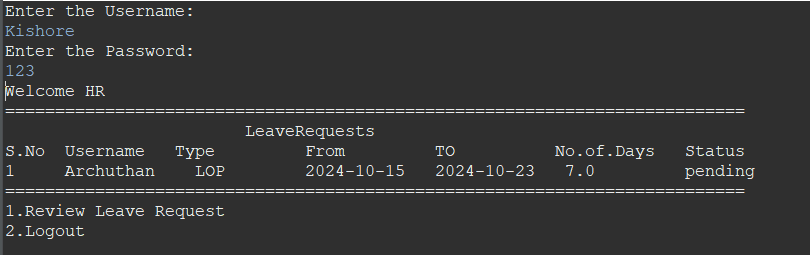
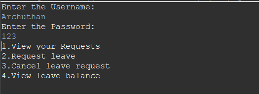

# Leave Management System

## Overview
The Leave Management System project demonstrates how to handle employee leave requests effectively. It encompasses tasks such as managing various types of leaves, submitting and approving requests, keeping track of leave balances, and validating inputs.

## KeyFeatures
- **Roles** : Two roles - HR and Employee
- **HR** : HR login allows the user to view all the leave requests from the employees
- **Employee** : Employee login allows to view all the leaves requested by the user,request for a new leave, cancel a leave and view how much sick leave and casual leave are left
- **Dates validation** : The employee requests for leave and the requested leave is validated, in basis of any dates in the past,dates that lie on the saturdays, sundays and holidays and dates that lie in the past are not accepted
- **Sick and Casual Leave Validation** Each employee is given 12 sick leave and 12 casual leave for a year so when a employee applies leave on sick or casual leave the leave count for the respective type is checked for availablity
- **Deletes the completed leaves** : If a leave date is over then the date is removed from database to free up space

## Roles and Permissions
### HR role

- HR can view all the leave requests sent by the employees
- HR can review any request to approve or reject the request
  
### Employee

- Employees can view all the leaves they have requested for till now
- Employees can request for a new leave request
- Employees can cancel any previous request
- Employees can view how much sick and casual leave they have left
 
## Prerequisites
 
Before running the system, ensure you have the following:
 
- Java JDK installed
- MySQL database setup
 
## Installation
 
1. Install JDK.
2. Install Eclipse.
3. Install MySQL Workbench.
4. Set up your MySQL database with the required schema using the `Leave_Management.sql` file.

## Database Setup
1. Install the provided SQL file in your MySQL Workbench.
2. This file contains the necessary database schema and initial data required for the Payroll System to function properly.

## Usage
 
1. Run the main program to start the Leave Management System.
2. Use the provided interface to manage leaves, approve requests, and view schedules.
 
## Database Schema
 
The database schema includes tables such as User and leave requests. Refer to the `Leave_Management.sql` file for details.
